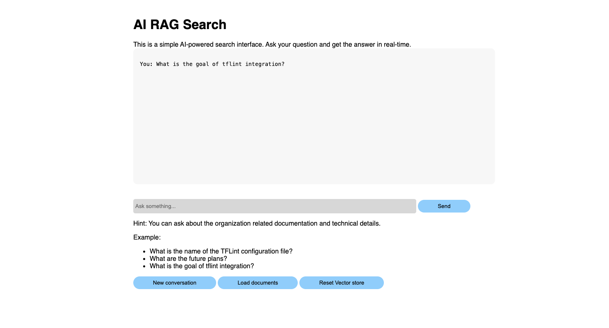

# ai-rag-doc-search
Document search with RAG


# API

How to preapre api for local running

```bash
# Stop and remove all containers and volumes
podman compose down -v
```

```bash
docker-compose down -v
```

```bash
# Build and start the containers
podman compose up --build
```

```bash
docker-compose build ollama
```

```bash
docker-compose up
```


## Frontend

Frontend url is http://localhost:8080




```bash
# Initialize a question session
curl -X POST http://localhost:8900/init-question \
    -H "Content-Type: application/json" \
    -N \
    -d '{
        "session_id": "test1",
        "question": "What is the name of the TFLint configuration file?"
    }'
```

```bash
# Ask a question in an existing session
curl -N -H "Content-Type: application/json" \
    -d '{"session_id":"tflint01", "question":"What is the name of the TFLint configuration file?"}' \
    http://localhost:8900/init-question
```

```bash
# Continue the conversation in the same session
curl -N -H "Content-Type: application/json" \
    -d '{"session_id":"tflint01", "question":"Is there any plugin for TFLint?"}' \
    http://localhost:8900/conversation
```

```bash
# Start a new conversation session
curl -X POST http://localhost:8900/new-conversation \
    -H "Content-Type: application/json" \
    -d '{"session_id": "user123"}'
```

```bash
# Reset the vector store
curl -X POST http://localhost:8900/reset-vector-store
```

```bash
# Load documents into the vector store
curl -X POST http://localhost:8900/load-documents
```

```bash
cd rag-prototype/api

poetry install 3.11

poetry env activate
```

